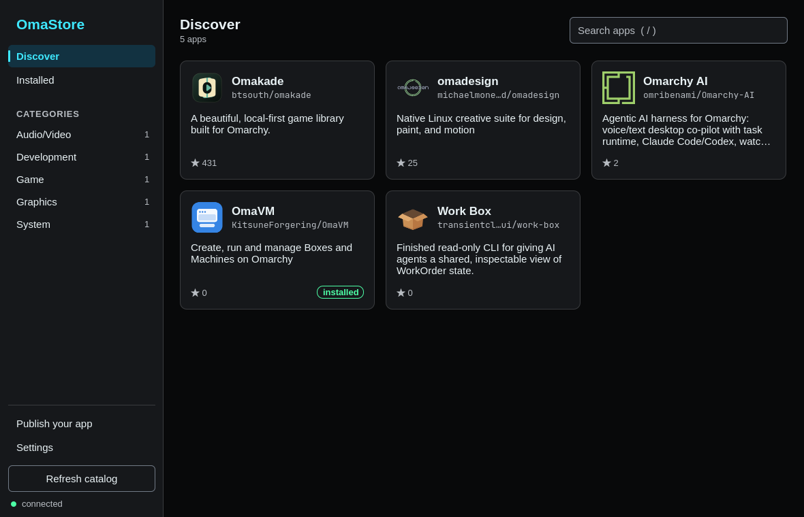

# KitsuneForgering

We build apps and desktop extensions for [Omarchy](https://omarchy.org/). If you use Omarchy and want to find apps, manage other operating systems, read feeds, edit video, or change the look of your desktop, start with the project that fits your task.

## Start with OmaStore

[OmaStore](https://github.com/KitsuneForgering/OmaStore) helps you discover, install, update, and remove standalone Linux apps from their GitHub releases. It installs apps into your user account and has a desktop interface and a CLI. The catalog is still small because an app needs an `omastore.toml` in its repository to join.

*The OmaStore catalog. Open an app to inspect it before installing. [Installation and usage →](https://github.com/KitsuneForgering/OmaStore#install)*

## Explore the projects

| Project | What you can do | Where to begin |
| --- | --- | --- |
| [OmaStore](https://github.com/KitsuneForgering/OmaStore) | Find and manage standalone apps for Omarchy. | [Install and use](https://github.com/KitsuneForgering/OmaStore#install) |
| [OmaVM](https://github.com/KitsuneForgering/OmaVM) | Create Linux development Boxes with Distrobox or boot full Machines with QEMU/KVM, from a desktop app or CLI. It is still under active development and has not reached 1.0. | [Requirements and quick start](https://github.com/KitsuneForgering/OmaVM#requirements) |
| [Feader RSS](https://github.com/KitsuneForgering/Feader-RSS) | Read RSS and Atom feeds in an Omarchy shell panel, with local article caching, search, and OPML import. | [Installation](https://github.com/KitsuneForgering/Feader-RSS#installation) |
| [OmaMovie](https://github.com/KitsuneForgering/OmaMovie) | Try a video editor for Omarchy: import media, arrange clips, preview a timeline, and export MP4. It is under development. | [Try the editor](https://github.com/KitsuneForgering/OmaMovie#try-the-editor) |
| [Sword Art Omarchy](https://github.com/KitsuneForgering/omarchy-sword-art-theme) | Apply a Sword Art Online–inspired theme to Omarchy 4. This is a fan project. | [Compatibility and installation](https://github.com/KitsuneForgering/omarchy-sword-art-theme#install) |
| [Omarchy Glass](https://github.com/KitsuneForgering/omarchy-glass) | Add a translucent bar and menu to the Omarchy shell. The plugin requires Omarchy 4.0.4 or newer. | [Install the plugin](https://github.com/KitsuneForgering/omarchy-glass#install) |
| [Widget on Glass](https://github.com/KitsuneForgering/Widget-on-glass) | Try the glass treatment across more shell surfaces. Its full installer patches an Omarchy source checkout and uses `sudo` to link it. This is a pilot tested on specific versions. | [Compare the two install paths](https://github.com/KitsuneForgering/Widget-on-glass#two-ways-to-use-it) |

Each project README has its own requirements and setup steps. Start there before installing, especially for OmaVM's virtualization dependencies and OmaMovie's build dependencies.

## Get involved

Found a bug or have an idea? Open an issue in the relevant project so it reaches the people working on that code. For OmaStore contributions, see its [contributing guide](https://github.com/KitsuneForgering/OmaStore/blob/master/CONTRIBUTING.md). Check each repository for its own development setup and license.
